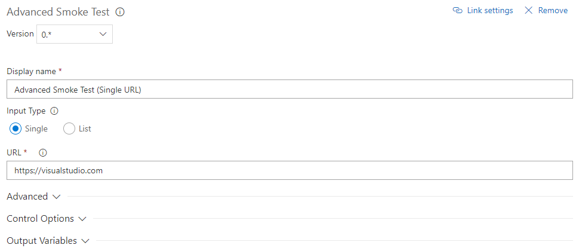

# Advanced Smoke Test
Build and release task for executing smoke tests against a single or multiple URLs.

This task is using the [advanced-smoke npm package](https://www.npmjs.com/package/advanced-smoke) ([GitHub](https://github.com/petersendev/node-advanced-smoke)) which also offers a CLI.

## Single URL


## Multiple URLs

For multiple URLs a test for will be executed, if any of the tests fail, the task will fail.

## Advanced Options

### Expected HTTP status code
The HTTP status code which will be validated. If the server does not respond with the specified status code, the test will fail.

### HTTP method
The HTTP method which will be used for all requests.

### Timeout
Timeout in milliseconds for the server to respond. If no timeout is specified, the default from the request module (and in some cases from the OS) will be used.

### Headers
List of headers which will be sent with the request(s).
One per line, in the following format:
```
MyHeader=my header value
MySecondHeader=2nd
```

### Retries
Number of retries, which will be executed in case of any errors during the test(s). Useful if used directly after deployment to handle warmup.

### Retry delay
Delay (in milliseconds) between retries.

## Credits
"[Smoke](https://thenounproject.com/term/smoke/952776/)" icon by Beau Wingfield from [from the Noun Project](http://thenounproject.com/).